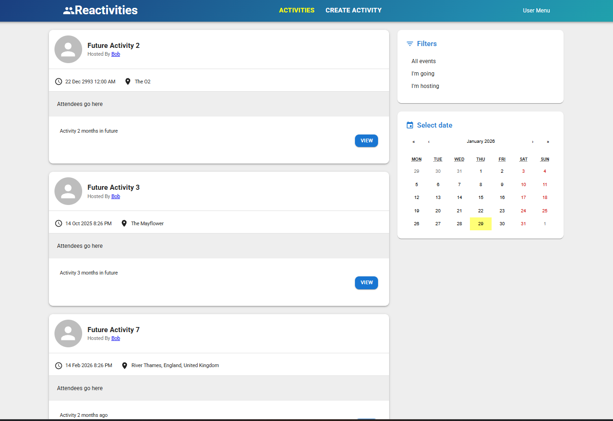
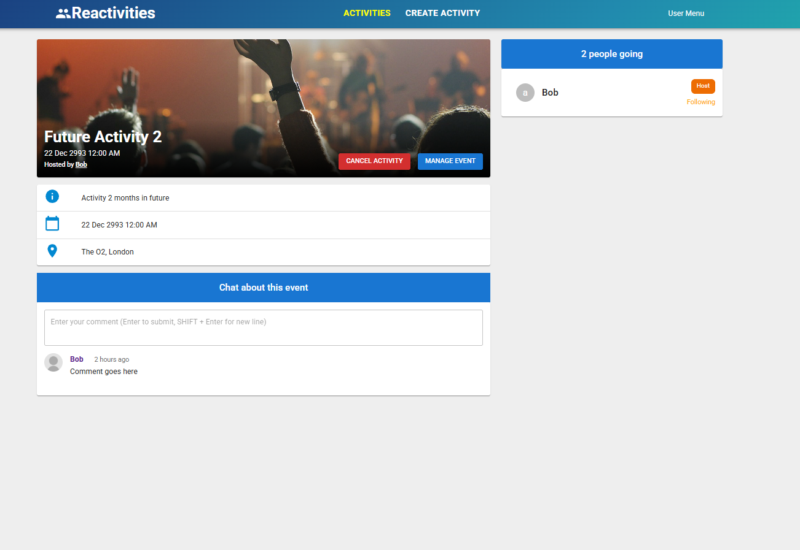

# Reactivities

Reactivities is a full-stack web application built with a **C# ASP.NET Core Web API** backend and a **React** frontend.  
The app allows users to create, view, edit, and manage activities with authentication and modern UI styling.

> ⚠️ **Work in Progress**  
> This project is actively being developed. Authentication and authorization are planned features and are not fully implemented yet.
> 
## 🚀 Features

- User authentication & authorization
- Create, read, update, and delete activities (CRUD)
- Responsive UI built with Material UI
- Clean architecture on the backend
- RESTful API communication using Axios
- Form validation and client-side state management

## 🛠 Tech Stack

### Backend
- C#
- ASP.NET Core Web API
- Entity Framework Core
- Clean Architecture
- SQLite / SQL Server (depending on environment)

### Frontend
- React
- TypeScript
- Material UI (MUI)
- Axios
- React Router

## 🧑‍💻 Installation Instructions
Follow the steps below to run the application locally.

Backend Setup 
1. cd API
2. dotnet restore
3. dotnet tool install --global dotnet-ef
4. dotnet ef database update
5. dotnet run 

Frontend Setup
1. cd client
2. npm install
3. npm start
   
## 📸 Screenshots 
### Activity Dashboard

### Create Activity

